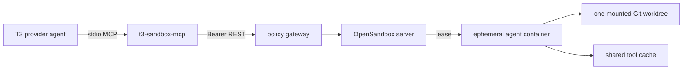

# Ephemeral Agent Sandboxes

This directory provides a separate execution plane for coding agents used by
T3 Code. The T3 container remains the control plane and keeps provider logins,
model keys, MCP credentials, rules, and conversation state. Commands that need
a disposable tool environment run through the `t3-sandbox` MCP server.

## Architecture



- The gateway accepts only workspace paths below one configured root.
- A worktree can have at most one active writer sandbox. Parallel agents use
  separate Git worktrees.
- Sandboxes have bounded CPU, memory, process count, command duration, and TTL.
- A generated gateway token is the only sandbox credential passed to T3.
  Provider and model credentials are never forwarded to worker containers.
- Worker containers are non-root and use the Docker default seccomp/AppArmor
  profiles, dropped capabilities, and `no-new-privileges`.
- Lease state is durable in SQLite. Worker containers are disposable; source
  changes stay in the mounted worktree and language caches stay in a named
  volume.

The gateway preserves linked Git worktrees by mounting their Git common
directory at the same in-container path. This keeps normal `git status`, commit,
and branch operations working without exposing unrelated workspace trees.

## Agent Base Image

`Dockerfile.agent` contains a broad, reusable tool baseline:

- Node.js, Python, `uv`, Go, Rust, Java, C/C++, CMake, Ninja, Gradle/Maven cache
  locations, Git, Git LFS, GitHub CLI, and common database clients
- `rg`, `fd`, `bfs`, `ugrep`, ctags, `jq`, `yq`, ShellCheck, debuggers,
  coverage/benchmark tools, tracing, SSH, rsync, and network diagnostics
- FFmpeg/ffprobe, ImageMagick, libvips, WebP and HEIF tools, ExifTool,
  MediaInfo, gifsicle, jpegoptim, optipng, and pngquant
- Tesseract OCR in English and German, Poppler/qpdf, Pandoc, Graphviz, SoX,
  Chromium/Xvfb, QR/barcode decoding, XML utilities, and common archive formats

Agents can install user-scoped npm, Python/uv, Cargo, and Go tools into the
workspace-specific persistent cache. Additional OS packages belong in a
project Dev Container image so setup is reproducible; runtime privilege
escalation is intentionally unavailable.

## Dev Containers

With profile `auto`, the gateway uses `.devcontainer/devcontainer.json` when it
exists and falls back to the base image otherwise. Images are built with the
official Dev Container CLI and Docker BuildKit, so normal Docker layer caching
applies.

The accepted subset supports `image`, `build`, allowlisted Features,
`containerEnv`, `remoteEnv`, and create/start lifecycle commands. Host-affecting
options such as privileged mode, capabilities, arbitrary mounts, Compose,
Docker socket access, and `${localEnv:...}` expansion are rejected. The final
image must declare a non-root `USER`.

Dev Container Dockerfiles and Features execute during a rootful Docker build.
Only enable this profile for repositories and Feature registries you trust.
Use `T3_SANDBOX_DEVCONTAINER_FEATURE_PREFIXES` to narrow the allowed registries,
or disable Dev Containers with `T3_SANDBOX_DEVCONTAINER_ENABLED=0`.

The repository root includes a conservative `.devcontainer/devcontainer.json`
that builds the same agent base locally. Projects can reuse the published base
directly or derive a Dockerfile from it for additional dependencies.

For the smallest project configuration, use the prebuilt non-root base:

```json
{
  "image": "ghcr.io/traktuner/docker-t3-code:agent-base",
  "remoteUser": "agent"
}
```

For group-protected network storage, the gateway derives a thin cached image
that adds the declared non-root user to `T3_SANDBOX_WORKSPACE_GID`. Custom
images therefore need a normal `/etc/passwd` entry plus `groupadd`/`usermod`
or Alpine-compatible `addgroup`; deriving from the agent base already satisfies
those requirements.

## Local Compose

Create two independent random values and start the example stack:

```bash
export OPEN_SANDBOX_API_KEY="$(openssl rand -hex 32)"
export T3_SANDBOX_GATEWAY_TOKEN="$(openssl rand -hex 32)"
export T3_SANDBOX_TOKEN="$T3_SANDBOX_GATEWAY_TOKEN"
export T3_SANDBOX_URL=http://t3-sandbox-gateway:8090
export T3_SANDBOX_HOST_WORKSPACE_ROOT=/absolute/host/workspace/root
docker compose up --build -d
docker compose -f sandbox/docker-compose.example.yml up --build -d
```

The T3 Compose project creates `T3_PLATFORM_NETWORK`; the sandbox project joins
it as an external network and gives its gateway the stable
`t3-sandbox-gateway` alias. To run the sandbox stack by itself, create that
network once with `docker network create t3-agent-platform`.

The production infra stack generates both values once into a private named
volume, so no external secret-manager entries are required for this subsystem.
The long-running gateway performs secret, cache, and configuration setup
idempotently before serving requests. OpenSandbox waits for those files during
startup. No completed init containers remain in the Compose project. The
OpenSandbox TOML is rendered and syntax-checked on every gateway start, so the
host-path allowlist always follows the configured workspace root.

Configure T3 with:

```text
T3_SANDBOX_URL=http://t3-sandbox-gateway:8090
T3_SANDBOX_TOKEN_FILE=/run/t3-sandbox/gateway-token
T3_SANDBOX_WORKSPACE=/workspace
T3_SANDBOX_MCP_RECONCILE=1
T3_OPENCODE_SANDBOX_INSTRUCTIONS=1
T3_OPENCODE_SANDBOX_ONLY=1
```

The entrypoint idempotently registers the same MCP bridge for OpenCode, Codex,
Claude, Cursor, and Grok when each harness is enabled. The tools are:

- `sandbox_create`
- `sandbox_exec`
- `sandbox_status`
- `sandbox_list`
- `sandbox_renew`
- `sandbox_destroy`

An agent should create or reuse a sandbox before a build or tool-heavy task,
run commands there, and destroy it when finished. Expired leases are also
removed by OpenSandbox.

When `T3_OPENCODE_SANDBOX_INSTRUCTIONS=1`, the main container adds a managed
global OpenCode instruction file describing this lifecycle. With
`T3_OPENCODE_SANDBOX_ONLY=1`, local read/edit/search/shell/subagent tools are
denied and the agent must perform repository work through `t3-sandbox`.

## Configuration

Important gateway variables:

| Variable | Default | Purpose |
| --- | --- | --- |
| `T3_SANDBOX_HOST_WORKSPACE_ROOT` | `/workspaces` | Canonical host workspace root |
| `T3_SANDBOX_CLIENT_WORKSPACE_ROOT` | `/workspace` | Matching path visible to T3 |
| `T3_SANDBOX_BASE_IMAGE` | `...:agent-base` | Default worker image |
| `T3_SANDBOX_MAX_CONCURRENT` | `4` | Global active lease limit |
| `T3_SANDBOX_DEFAULT_TTL_SECONDS` | `7200` | Default worker lifetime |
| `T3_SANDBOX_MAX_TTL_SECONDS` | `28800` | Maximum worker lifetime |
| `T3_SANDBOX_MAX_COMMAND_SECONDS` | `1800` | Maximum command runtime |
| `T3_SANDBOX_MAX_OUTPUT_BYTES` | `262144` | Maximum returned bytes per output stream |
| `T3_SANDBOX_CPU_LIMIT` | `4` | CPU limit per worker |
| `T3_SANDBOX_MEMORY_LIMIT` | `8Gi` | Memory limit per worker |
| `T3_SANDBOX_EGRESS_ALLOW` | empty | Optional comma-separated egress allowlist |
| `T3_SANDBOX_DEVCONTAINER_ENABLED` | `1` | Permit trusted Dev Container builds |
| `T3_SANDBOX_DEVCONTAINER_FEATURE_PREFIXES` | official registries | Feature allowlist |
| `T3_SANDBOX_WORKSPACE_GID` | `3001` | Supplemental share group injected into Dev Container users |
| `T3_SANDBOX_RUNTIME_NETWORK` | `t3-sandbox-runtime` | Private Docker network used by workers |
| `T3_SANDBOX_DOCKER_NETWORK_MODE` | runtime network | Optional worker network-mode override |
| `T3_SANDBOX_PORT_RANGE_MIN/MAX` | `40000`/`40200` | Worker endpoint allocation range |
| `T3_SANDBOX_EXECD_IMAGE` | `opensandbox/execd:v1.0.20` | OpenSandbox command sidecar |
| `T3_SANDBOX_EGRESS_IMAGE` | `opensandbox/egress:v1.1.3` | Optional policy sidecar |
| `T3_SANDBOX_SECURE_RUNTIME` | empty | Optional `gvisor` or `kata` runtime |
| `T3_SANDBOX_DOCKER_RUNTIME` | inferred | Docker runtime name for secure mode |

Every secret accepts a file variant: `OPEN_SANDBOX_API_KEY_FILE` and
`T3_SANDBOX_GATEWAY_TOKEN_FILE` take precedence when the direct value is empty.

Unrestricted egress is the default because package installation is a primary
worker use case. To enable `T3_SANDBOX_EGRESS_ALLOW`, also set
`T3_SANDBOX_DOCKER_NETWORK_MODE=bridge`; the renderer rejects an incompatible
custom-network policy before OpenSandbox starts. Bridge mode uses
`T3_SANDBOX_DOCKER_HOST_IP` for server-proxied worker endpoints.

## Security Boundary

The default Docker/runc runtime is appropriate for trusted personal code and
accidental-failure containment. It is not a strong multi-tenant boundary
against hostile container workloads. For untrusted repositories, configure an
OpenSandbox secure runtime such as gVisor or Kata Containers, or move the data
plane to a Kubernetes sandbox platform with dedicated nodes and network policy.

The gateway itself needs Docker socket access solely to build trusted Dev
Container images. Keep it private, do not publish port 8090 through a reverse
proxy, and do not attach the worker runtime network to the T3 control plane.
